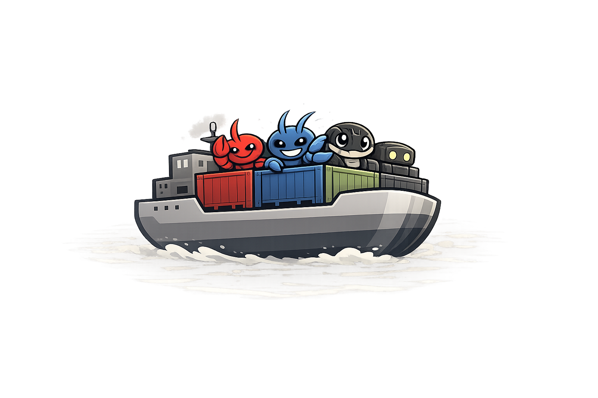

# Spawnfile

> A spec and compiler for autonomous agent runtimes. Write your agent once, compile for any runtime.

<p align="center">
  <a href="https://www.npmjs.com/package/spawnfile"></a>
  <a href="https://www.npmjs.com/package/spawnfile"></a>
  <a href="#from-source"></a>
  <a href="LICENSE"></a>
  <a href="https://spawnfile.com"></a>
</p>

<p align="center">
  
</p>

Spawnfile is a **portable source format** for autonomous agents and teams. You write one canonical project — identity docs, skills, MCP connections, model and sandbox intent, team structure — and `spawnfile compile` lowers it into the runtime-specific config and workspace each adapter needs.

It's not a runtime-to-runtime translator. The compiler starts from the canonical source, emits each declared adapter's output, and reports per-capability support as `supported`, `degraded`, or `unsupported`.

Pairs with [**Moltnet**](https://moltnet.dev) — the network layer that lets compiled agents share rooms, DMs, and history across runtimes.

## Install

```bash
npm install -g spawnfile
spawnfile --help
```

Node.js 22+ required. See [source install](#from-source) for local development.

## The happy path

```bash
spawnfile init                                   # scaffold an agent (defaults to openclaw)
spawnfile validate                               # check the graph
spawnfile compile                                # lower to runtime-native output
spawnfile auth sync --profile dev --env-file .env
spawnfile build  --tag my-agent                  # compile + docker build
spawnfile run    --tag my-agent --auth-profile dev
```

Compiled output lands under `.spawn/` by default, including a `Dockerfile`, `entrypoint.sh`, `.env.example`, and a prebuilt `container/rootfs/` tree. `spawnfile build` uses the pinned runtime artifacts from `runtimes.yaml`; it does not rebuild runtimes from source.

## Project structure

A Spawnfile project is either an `agent` or a `team`.

**Agent**

```text
my-agent/
├── Spawnfile
├── IDENTITY.md         # who the agent is
├── SOUL.md             # tone and personality
├── AGENTS.md           # system prompt
├── MEMORY.md           # long-lived memory
├── HEARTBEAT.md        # periodic prompt for scheduled wakes
├── skills/
│   └── web_search/SKILL.md
└── subagents/
    └── researcher/Spawnfile
```

**Team**

```text
my-team/
├── Spawnfile
├── TEAM.md
├── shared/skills/...
└── agents/
    ├── orchestrator/Spawnfile
    ├── researcher/Spawnfile
    └── writer/Spawnfile
```

Team members may target different runtimes; the compiler resolves each member independently. Subagents are internal helpers owned by a parent agent — not the same thing as team members.

Not every file is required. Spawnfile names the portable roles; adapters decide how to lower them into runtime-native surfaces. See [`specs/SPEC.md`](specs/SPEC.md) for the full shape.

## Runtime support

v0.1 targets autonomous agent runtimes that share a markdown workspace identity model.

| Runtime   | Status        | Default | Surfaces                                      |
|-----------|---------------|---------|-----------------------------------------------|
| OpenClaw  | active        | ✅      | Discord, Telegram, WhatsApp, Slack            |
| PicoClaw  | active        |         | Discord, Telegram, Slack (WhatsApp blocked)   |
| TinyClaw  | active        |         | Discord, Telegram, HTTP                       |
| NullClaw  | exploratory   |         | No active adapter yet                         |
| ZeroClaw  | exploratory   |         | No active adapter yet                         |

Each adapter maps the portable schema into its native forms. The compiler reports a machine-readable `spawnfile-report.json` with the resolved graph, chosen runtimes, and capability outcomes (`supported`, `degraded`, `unsupported`). See [`specs/RUNTIMES.md`](specs/RUNTIMES.md) for the live matrix and pinned versions, or [`runtimes.yaml`](runtimes.yaml) for the registry source of truth.

## Why

Autonomous agent runtimes already share a meaningful core: markdown workspace identity, skill folders, MCP, model selection, sandboxing. Today that core is re-authored by hand for each runtime. Spawnfile makes it canonical so one source project can ship to any compatible runtime.

## Docs

Hosted docs with rendered specs, runtime guides, and a capability matrix: **[spawnfile.com](https://spawnfile.com)** — start at [Introduction](https://spawnfile.com/introduction/), [Quickstart](https://spawnfile.com/quickstart/), or the [Runtimes overview](https://spawnfile.com/runtimes/overview/).

The source-of-truth specs live in this repo:

- [`specs/INDEX.md`](specs/INDEX.md) — map of all specs
- [`specs/SPEC.md`](specs/SPEC.md) — canonical source format
- [`specs/COMPILER.md`](specs/COMPILER.md) — compiler architecture and adapter contract
- [`specs/CONTAINERS.md`](specs/CONTAINERS.md) — container compilation
- [`specs/RUNTIMES.md`](specs/RUNTIMES.md) — runtime registry and version pinning
- [`specs/SURFACES.md`](specs/SURFACES.md) — messaging surface model
- [`fixtures/`](fixtures/) — canonical example projects

## From source

```bash
git clone https://github.com/noopolis/spawnfile.git
cd spawnfile
nvm use
npm install
npm run build
npm link
```

To clone pinned runtimes and generate reference blueprints:

```bash
npm run runtimes:sync
```

For local development without linking globally:

```bash
npm run dev -- validate fixtures/single-agent
```

## Contributing

See [CONTRIBUTING.md](CONTRIBUTING.md) for local setup, tests, and the runtime adapter contract.

## License

MIT — see [LICENSE](LICENSE).

---

**[spawnfile.com](https://spawnfile.com)** · **[github.com/noopolis/spawnfile](https://github.com/noopolis/spawnfile)**
